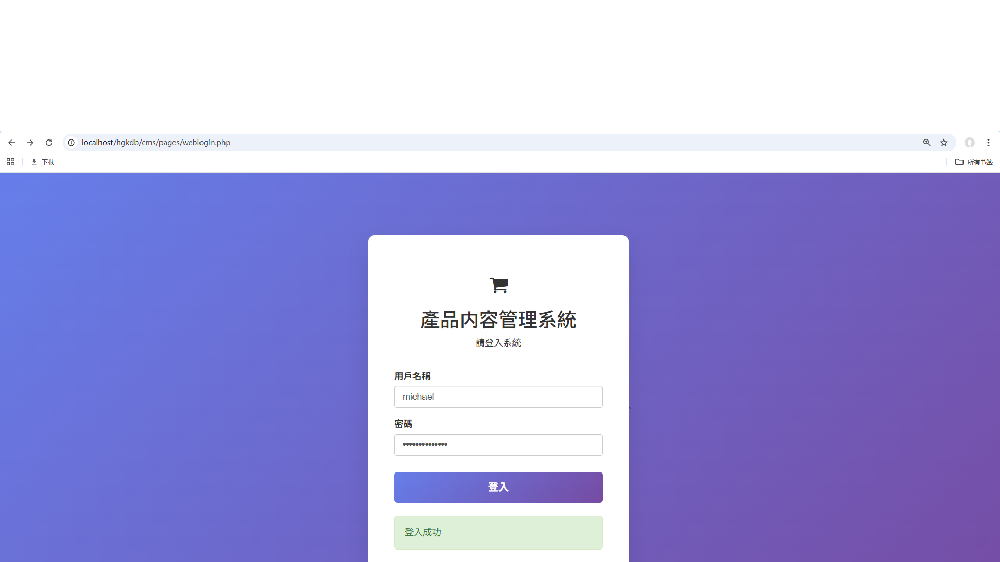
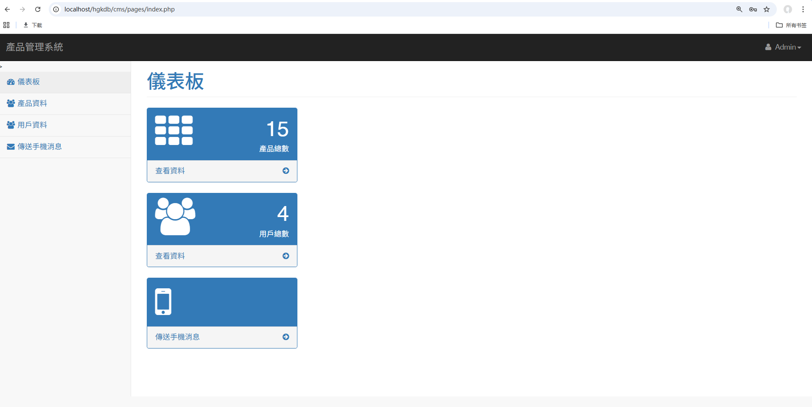
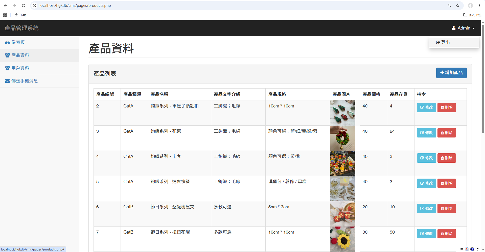
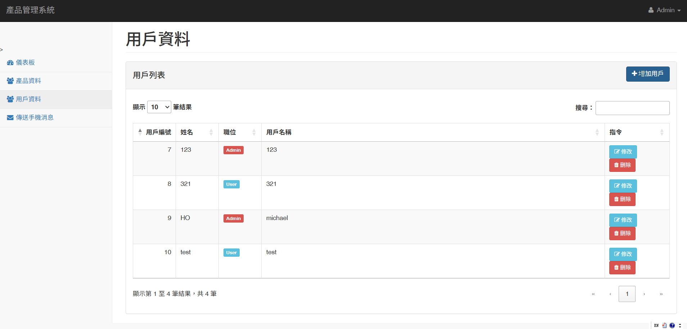
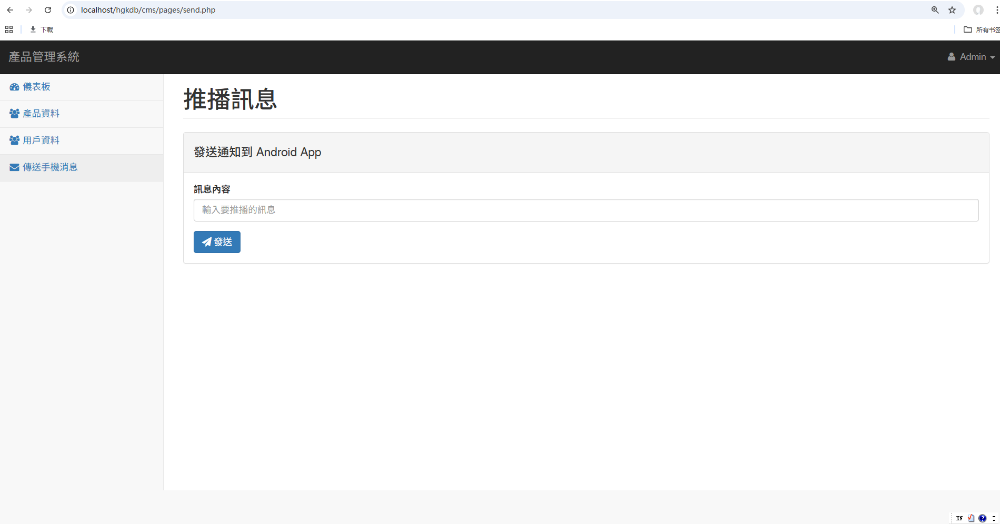
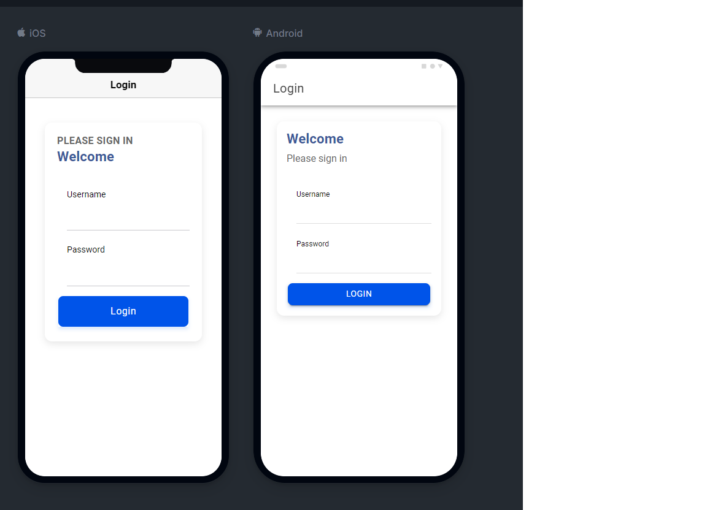
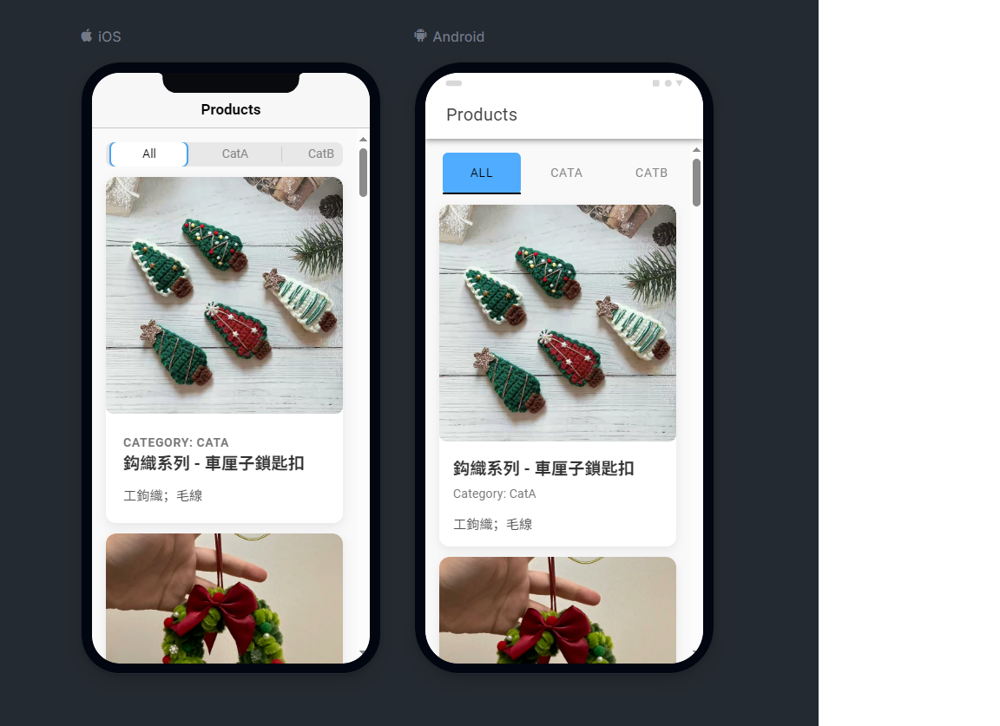
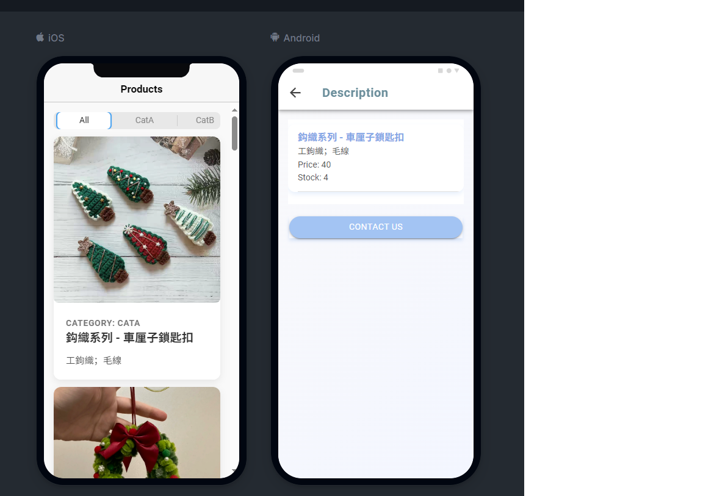
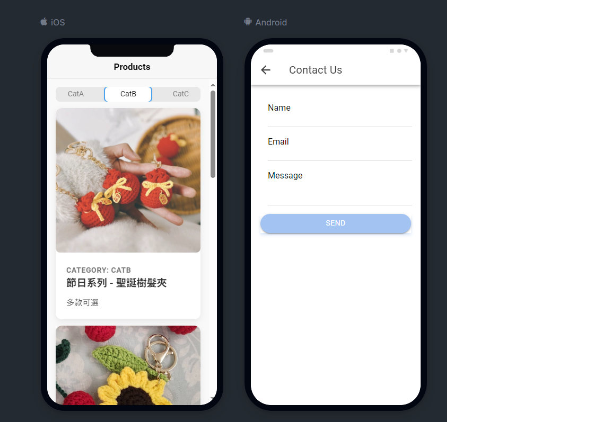
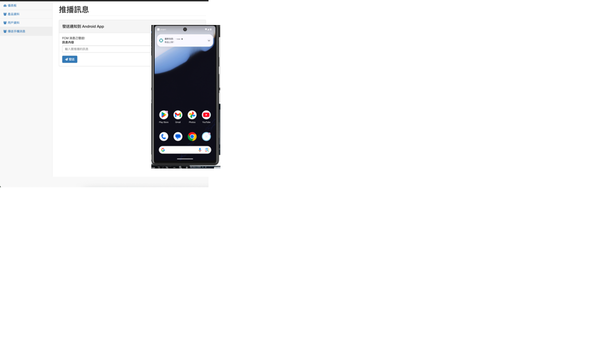

# Login & CRUD System (CMS v4.5) + Mobile App

## 📖 Overview
This repository contains:
1. **CMS Backend (PHP + MySQL)** → Secure authentication, role-based access, CRUD APIs.
2. **Mobile App (Ionic + Angular)** → Frontend client with Login, Products, Contact pages.

---

## 🚀 Features
- 🔑 **User Authentication** using JWT tokens (no PHP sessions)
- 👥 **Role-based Access Control** (Admin / User)
- 📊 **Dashboard API** with summary statistics
- 📝 **CRUD Operations** for Users & Products
- 📱 **Mobile App** with Login, Products filter, Contact form

---

## ⚠️ Important
- The **backend requires a MySQL database**.  
- If no database is connected, only the **frontend UI** will run.  
- To enable full functionality, configure `config.php` with your DB credentials.

---

## 🛠️ Tech Stack
- **Backend**: PHP (OOP, PDO, RESTful API)
- **Frontend (Web)**: JavaScript (ES6+), Bootstrap, DataTables
- **Frontend (Mobile)**: Ionic, Angular, Capacitor
- **Database**: MySQL

---

## 📂 Project Structure
cms/ → PHP backend  
mobile-app/ → Ionic Angular frontend  

---

## 📸 Screenshots 

### CMS 系統 
#### Login Page 
 
#### Dashboard 
 
#### Products CRUD 

#### User CRUD 

#### FCM Notification 


### Mobile App 
#### Login Page 
 
#### Products Page 
 
#### Description Page 
 
#### Contact Page 
 
#### Push Notification (FCM) 


---

## ⚡ How to Run
### CMS Backend
```bash
cd cms
php -S localhost:8000

