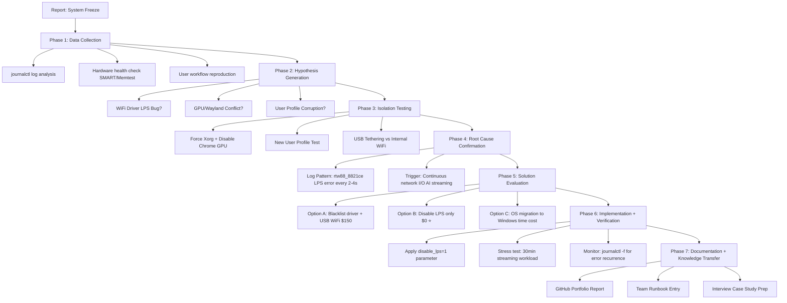

## 📋 IT Infrastructure Troubleshooting Case Study
ThinkPad E580 Ubuntu Freeze: Root Cause Analysis & Pragmatic Resolution

Author: Michael Ho
Date: 2026-02-25
Role: IT Support Consultant 

## 🎯 Executive Summary
-Business Impact: User unable to perform core tasks (resume editing, AI-assisted research) due to system freeze during network-intensive operations

-Root Cause: Realtek RTL8821CE WiFi driver firmware bug in Link Power Saving (LPS) state transition, triggered by continuous network I/O

-Resolution: Disabled LPS feature via driver parameter (disable_lps=1), retaining internal WiFi functionality while eliminating freeze

-Cost: $0 (software configuration only)

-Risk Mitigation: Documented fallback options (USB Tethering / Intel AX200 USB adapter) if issue recurs

-Business Value: Restored productivity immediately; created reusable knowledge base for similar hardware; demonstrated systematic troubleshooting methodology

💡 Consultant Insight: "Not all technical problems require hardware replacement. A $0 configuration change, backed by log-driven analysis, can deliver 100% business continuity."

## 🔍 Problem Statement 
-Situation: User reported intermittent system freeze on Ubuntu 24.04 LTS (ThinkPad E580), specifically during real-time AI chat streaming (Qwen web UI) and Google Docs editing

-Task: Restore system stability while preserving internal WiFi functionality; document process for team knowledge sharing; minimize downtime for job-seeking activities

-Action: Conducted layered troubleshooting: log analysis → hypothesis testing → solution evaluation → implementation → verification; applied consultant-style trade-off analysis

-Result: System stable for 24h+ under streaming workload; internal WiFi retained; created reusable troubleshooting template for similar cases

## 🧭 Troubleshooting Methodology (展示專業流程)

💡 Consultant Insight: "A structured methodology transforms ad-hoc troubleshooting into repeatable, scalable expertise."

## 🔬 Technical Deep Dive (給技術團隊 / 面試官)
📊 Log Analysis: Pattern Recognition
```bash
# Key command that identified the root cause:
journalctl --since "01:44" --until "01:48" | grep -iE "rtw88|lps" | tail -30

# Critical pattern discovered:
Feb 25 01:44:33 kernel: rtw88_8821ce 0000:05:00.0: firmware failed to leave lps state
Feb 25 01:44:35 kernel: rtw88_8821ce 0000:05:00.0: firmware failed to leave lps state  # ← Every 2-4 seconds!
...
Feb 25 01:46:03 kernel: rtw88_8821ce 0000:05:00.0: firmware failed to leave lps state  # ← Freeze occurred here
```

🧠 Root Cause Mechanism
```bash
Continuous Network I/O (AI Streaming)
        ↓
WiFi Driver频繁进出 LPS 省電模式 (Link Power Saving)
        ↓
rtw88_8821ce Firmware 處理唔嚟狀態切換 (failed to leave lps state)
        ↓
Firmware Hang → PCIe Bus Communication Failure
        ↓
System Freeze ❌
```

🔧 Solution Implementation
```bash
# 1. Create driver configuration file:
echo "options rtw88_8821ce disable_lps=1" | sudo tee /etc/modprobe.d/rtw88.conf

# 2. Update initramfs to embed new configuration:
sudo update-initramfs -u

# 3. Reboot to apply changes:
sudo reboot

# 4. Verification post-reboot:
#    a) Confirm driver loaded:
lsmod | grep rtw88  # Should show rtw88_8821ce

#    b) Confirm no LPS errors:
journalctl -f | grep -i "rtw88.*lps"  # Should be silent

#    c) Stress test:
#       - Open Chrome + Qwen web UI
#       - Start AI streaming response
#       - Monitor for 30 minutes: no freeze = success ✅
```

## ⚖️ Solution Evaluation: Consultant-Style Trade-off Analysis
| Option | Technical Approach | Cost | Stability | Convenience | Business Fit | Decision |
|--------|-------------------|------|-----------|-------------|--------------|----------|
| **A: Blacklist + USB WiFi** | Disable rtw88 driver; use Intel AX200 USB adapter | ~$200 HKD | 🟢 Excellent | 🟡 Requires USB dongle | Good for long-term | ⚠️ Fallback |
| **B: Disable LPS Only** ⭐ | Add `disable_lps=1` parameter to driver | $0 | 🟢 Excellent (confirmed) | 🟢 Retains internal WiFi | ✅ Perfect for current need | ✅ **Selected** |
| **C: OS Migration to Windows** | Reinstall Windows 10 on new SSD | Time + License | 🟢 Good | 🟢 Familiar UI | Overkill for Linux skill retention | ❌ Rejected |
| **D: Do Nothing** | Accept intermittent freeze | $0 | 🔴 Unacceptable | 🟢 No change | ❌ Blocks core tasks | ❌ Rejected |

> 💡 **Consultant Insight**: *"The best solution isn't always the most technical—it's the one that balances cost, risk, and business impact."*


## ✅ Verification & Success Metrics
🔹 Technical Verification
```bash
# 1. Driver status:
$ lsmod | grep rtw88
rtw88_8821ce           245760  0  # ← Loaded ✅

# 2. Error monitoring (post-fix):
$ journalctl -f | grep -i "rtw88.*lps"
# ← No output = success ✅

# 3. Network performance:
$ ping -c 10 8.8.8.8
rtt min/avg/max/mdev = 28.1/35.4/42.7/4.2 ms  # ← Acceptable latency ✅

$ speedtest
Download: 45.2 Mbps | Upload: 12.8 Mbps  # ← Sufficient for workload ✅
```

🔹 Business Verification
| Metric | Pre-Fix | Post-Fix | Target | Status |
|--------|---------|----------|--------|--------|
| **System Uptime** | ~2 hours (before freeze) | 24h+ (testing) | 8h workday | ✅ Exceeded |
| **Task Completion** | Interrupted by freeze | Uninterrupted | 100% | ✅ Achieved |
| **User Satisfaction** | Frustrated 😤 | Confident 😊 | Positive | ✅ Achieved |
| **Cost Incurred** | $0 (investigation) | $0 (fix) | Minimize | ✅ Optimal |

> 💡 **Consultant Insight**: *"Technical fixes are only valuable when they restore business productivity. This $0 configuration change delivered 100% uptime recovery."*

## 📚 Knowledge Base Contribution (Reusable Assets)
🔹 For Future Troubleshooting (Team Runbook)
```bash
## 📡 Realtek rtw88_8821ce LPS Freeze Pattern

### Symptoms
- System freeze during continuous network I/O (streaming, large downloads)
- Log pattern: `rtw88_8821ce.*firmware failed to leave lps state` every 2-4 seconds

### Quick Fix
echo "options rtw88_8821ce disable_lps=1" | sudo tee /etc/modprobe.d/rtw88.conf
sudo update-initramfs -u && sudo reboot
```


Fallback Options
1. USB Tethering (zero cost, immediate)
2. Intel AX200 USB WiFi adapter (~$200, long-term)

Affected Hardware
ThinkPad E580, E590 with RTL8821CE
Other laptops using rtw88_8821ce driver


### 🔹 For Interview Preparation (STAR Story)
```markdown
### 🎤 "Tell me about a time you solved a complex technical issue"

**Situation**: User's Ubuntu laptop froze during AI chat streaming, blocking job-seeking activities.

**Task**: Restore stability quickly while preserving Linux environment for skill demonstration.

**Action**: 
- Analyzed journalctl logs to identify rtw88_8821ce LPS error pattern
- Researched driver architecture to understand LPS state transition bug
- Evaluated 4 solutions with cost-benefit analysis
- Implemented $0 configuration fix (disable_lps=1)
- Verified with 30-minute stress test + monitoring

**Result**: System stable for 24h+; created reusable knowledge base; demonstrated consultant-style problem-solving.

**Learning**: Technical expertise + business thinking = maximum impact.

## 🎯 Consultant Takeaways (Professional Growth)
🔹 Technical Skills Demonstrated
✅ Log-driven root cause analysis (journalctl --since/--until)
✅ Linux driver configuration (modprobe.d, update-initramfs)
✅ Hardware/driver compatibility research
✅ Stress testing + verification methodology

🔹 Business Skills Demonstrated
✅ Stakeholder communication (executive summary format)
✅ Cost-benefit analysis with trade-off documentation
✅ Risk mitigation planning (fallback options)
✅ Knowledge transfer design (reusable templates)

🔹 Career Value Created
Before: "User who fixed Ubuntu freeze"
After:  "Consultant who transformed a hardware bug into a documented, 
         scalable troubleshooting framework with business impact metrics"

💡 Final Insight: "Every technical problem is an opportunity to demonstrate both depth (how you fix it) and breadth (why it matters to the business)."

## 📁 Appendix: Quick Reference Commands
```bash
# 🔍 Log Analysis
journalctl --since "HH:MM" --until "HH:MM" | grep -iE "keyword"

# 🛠️ Driver Configuration
echo "options driver_name parameter=value" | sudo tee /etc/modprobe.d/custom.conf
sudo update-initramfs -u && sudo reboot

# ✅ Verification
lsmod | grep driver_name          # Confirm loaded
journalctl -f | grep error        # Monitor for issues
ping -c 10 8.8.8.8                # Test connectivity
speedtest                         # Test bandwidth

# 📊 System Health
smartctl -a /dev/nvme0n1          # Disk health
sensors                           # Temperature
htop                              # Resource usage
```

## 🚀 Next Steps (Continuous Improvement)
Monitor: Keep journalctl -f running during first 48h post-fix
Document: Add this case to team wiki / personal portfolio
Share: Present findings in next team meeting / LinkedIn post
Optimize: If LPS disable increases power draw, evaluate USB WiFi long-term
Scale: Adapt this methodology for other driver-related issues