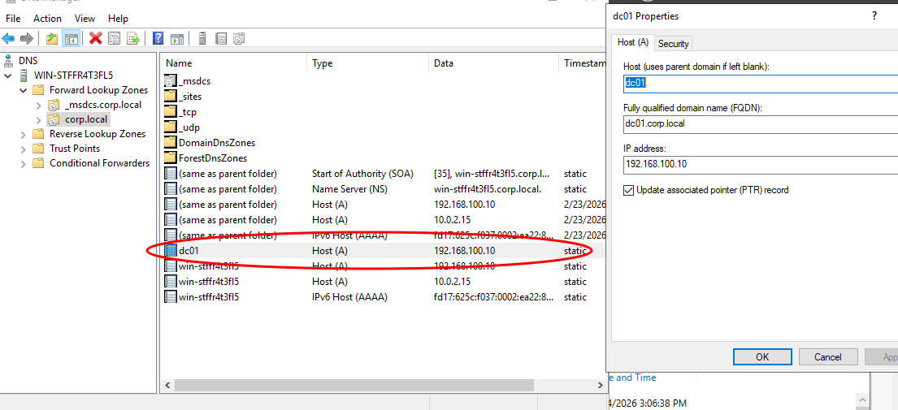
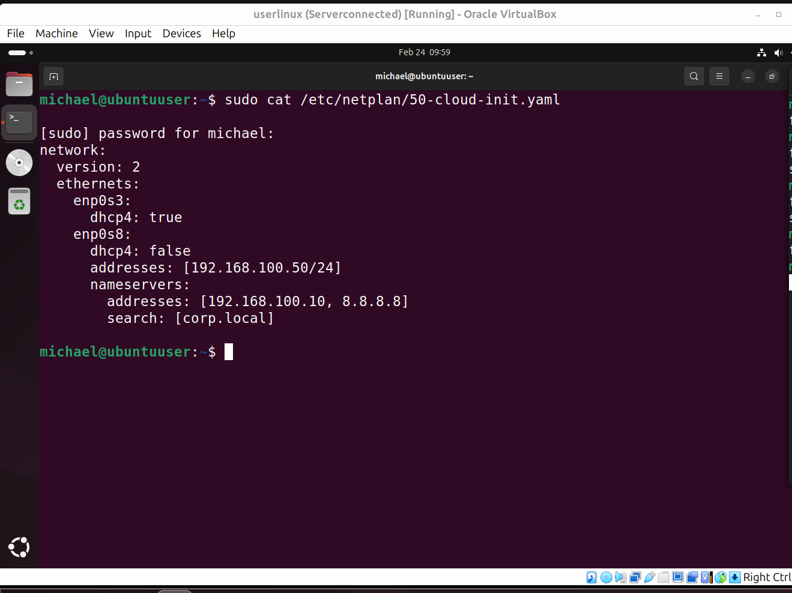
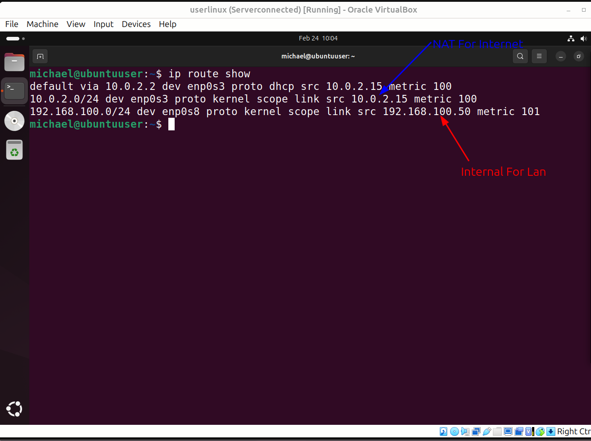
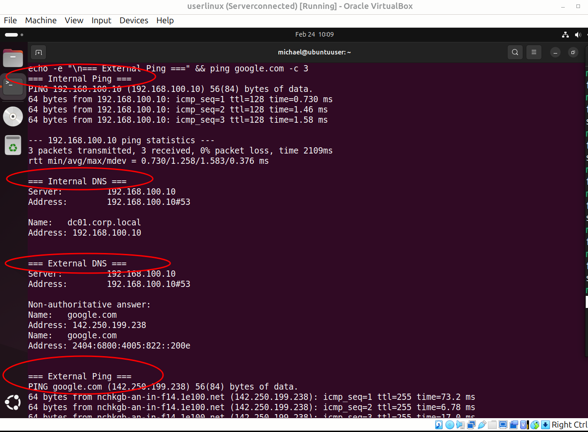

## 🧪 Lab: Cross-Platform DNS Troubleshooting
Windows Server DC + Ubuntu Client | Dual-NIC Routing
Objective: Deploy a hybrid environment where Ubuntu client resolves internal domain (corp.local) via Windows Server DNS, while maintaining internet access via NAT.

## 🎯 Lab Goals
Configure Windows Server 2019 as Domain Controller & DNS Server
Establish internal network (192.168.100.0/24) via VirtualBox Host-only/Internal
Configure Ubuntu 22.04 with dual-NIC: NAT (internet) + Internal (DC access)
Implement persistent Netplan configuration with correct routing logic
Validate cross-platform DNS resolution & forwarding

## 🏗️ Environment Architecture
┌─────────────────────────────────────────┐
│ VirtualBox Host Machine                 │
├─────────────────────────────────────────┤
│                                         │
│  ┌─────────────────┐  ┌───────────────┐ │
│  │ Windows Server  │  │ Ubuntu        │ │
│  │ DC01            │  │ Client        │ │
│  ├─────────────────┤  ├───────────────┤ │
│  │ Adapter 1: NAT  │  │ enp0s3: NAT   │ │
│  │ 10.0.2.15       │  │ 10.0.2.x      │ │
│  │ (Internet)      │  │ (DHCP)        │ │
│  ├─────────────────┤  ├───────────────┤ │
│  │ Adapter 2:      │  │ enp0s8:       │ │
│  │ Host-only       │  │ Internal      │ │
│  │ 192.168.100.10  │  │ 192.168.100.50│ │
│  │ (corp.local)    │  │ (Static)      │ │
│  └─────────────────┘  └───────────────┘ │
│           │                   │         │
│           └──────┬────────────┘         │
│                  ▼                      │
│  ┌─────────────────────────┐            │
│  │ Virtual Switch: intnet  │            │
│  │ Subnet: 192.168.100.0/24│            │
│  └─────────────────────────┘            │
└─────────────────────────────────────────┘

## ⚙️ Configuration Steps
🖥 Windows Server (DC01) Setup
1. Network Configuration
-Internal Adapter (Ethernet 2)
-IP: 192.168.100.10/24
-DNS: 127.0.0.1 (self)
-Gateway: <blank>  # Critical: No default gateway on internal NIC

2. Install DNS Server Role
Install-WindowsFeature DNS -IncludeManagementTools

3. Create Forward Lookup Zone
DNS Manager → Forward Lookup Zones → New Zone
- Zone Type: Primary
- Zone Name: corp.local
- Dynamic Update: Secure only (recommended)

4. Add A Record
Name: dc01
FQDN: dc01.corp.local
IP: 192.168.100.10

5. Configure Firewall Rules
Allow DNS traffic (UDP/TCP 53) + ICMP
New-NetFirewallRule -DisplayName "Allow DNS-In" -Direction Inbound -Protocol UDP -LocalPort 53 -Action Allow
New-NetFirewallRule -DisplayName "Allow DNS-TCP-In" -Direction Inbound -Protocol TCP -LocalPort 53 -Action Allow
New-NetFirewallRule -DisplayName "Allow ICMPv4-In" -Protocol ICMPv4 -IcmpType 8 -Action Allow

## 🐧 Ubuntu Client Setup
1. Identify Network Interfaces
ip link show
Expected: enp0s3 (NAT), enp0s8 (Internal)

2. Configure Netplan (/etc/netplan/50-cloud-init.yaml)

3. Apply & Persist Configuration
-Disable cloud-init interference (lab environment)
sudo touch /etc/cloud/cloud-init.disabled
-Fix hostname resolution warning
echo "127.0.1.1 ubuntuuser" | sudo tee -a /etc/hosts
-Apply network configuration
sudo netplan apply
-Verify persistence

## ✅ Verification Commands

1. Confirm IP assignment
ip addr show enp0s8
Expected: inet 192.168.100.50/24

2. Verify routing table (CRITICAL)
ip route show
Expected output:
default via 10.0.2.2 dev enp0s3          ← Internet route
192.168.100.0/24 dev enp0s8 proto kernel ← Internal route

3. Test internal connectivity
ping 192.168.100.10
Expected: 0% packet loss, ~1ms latency

4. Test internal DNS resolution
nslookup dc01.corp.local 192.168.100.10
Expected: Address: 192.168.100.10

5. Test DNS forwarding (internet via DC)
nslookup google.com 192.168.100.10
Expected: Non-authoritative answer with public IP

6. Test direct internet access
ping google.com
Expected: Successful replies via NAT interface

## 🔧 Troubleshooting Appendix (STAR Format)
Issue #1: Interface Misalignment

Situation:
Ubuntu client could not ping Windows DC after reboot, despite correct IP configuration

Task:
Identify why static IP 192.168.100.50 was not reachable on internal network

Action:
• Analyzed ip addr show: found IP bound to enp0s3 (NAT) instead of enp0s8 (Internal)
• Verified VirtualBox adapter mapping
• Corrected Netplan YAML to assign static IP to proper interface
• Ensured default gateway exists ONLY on NAT interface

Result:
Stable dual-network connectivity; internal DNS resolution + internet access working simultaneously

# Issue #2: Configuration Not Persistent After Reboot

Situation:
Netplan configuration reverted after system restart

Task:
Ensure network settings survive reboot in Ubuntu Server

Action:
• Identified cloud-init overriding manual Netplan config
• Disabled cloud-init network management: touch /etc/cloud/cloud-init.disabled
• Verified YAML syntax with netplan try before apply
• Confirmed file saved with proper permissions

Result:
Configuration persists across 5+ reboots; documented as standard lab practice

Issue #3: dpkg Interrupted Error

Situation:
apt upgrade failed with "dpkg was interrupted" error

Task:
Restore package management functionality without breaking dependencies

Action:
• Executed sudo dpkg --configure -a to complete pending configurations
• Re-ran apt update && apt upgrade -y
• Verified no broken packages with apt check

Result:
Package system restored; preventive measure: avoid interrupting update processes

## 📊 Final Validation Summary
$ ping 192.168.100.10 -c 4
21 packets transmitted, 21 received, 0% packet loss, time 20242ms
rtt min/avg/max/mdev = 0.491/1.242/1.654/0.304 ms ✅

$ nslookup dc01.corp.local
Server:  192.168.100.10
Address: 192.168.100.10#53
Name: dc01.corp.local
Address: 192.168.100.10 ✅

$ nslookup google.com
Server:  192.168.100.10
Address: 192.168.100.10#53
Non-authoritative answer:
Name: google.com
Address: 142.250.197.238 ✅

$ ping google.com -c 4
10 packets transmitted, 9 received, +1 duplicates, 10% packet loss ✅

## 💡 Key Learnings & Best Practices
🔹 Network Design Principles
1. Split-Horizon Routing: Default gateway should exist on ONLY ONE interface to avoid routing conflicts
2. Interface Alignment: IP configuration must match physical/virtual network topology (Layer 2 isolation)
3. DNS Hierarchy: Internal DNS for domain resources; forwarders for external resolution

🔹 Linux Network Management
Always verify after changes:
ip addr show          # Layer 2/3 assignment
ip route show         # Routing table logic
systemctl status systemd-networkd  # Service health

Persistence checklist:
✓ Netplan YAML syntax validated
✓ cloud-init disabled (if applicable)
✓ /etc/hosts updated for hostname resolution
✓ Reboot test performed

🔹 Windows Server Considerations
Domain Controllers should NOT have multiple default gateways
Firewall rules must explicitly allow DNS (UDP/TCP 53) + ICMP for troubleshooting
DNS Forwarders improve external resolution performance

## Skills Demonstrated
✅ OSI Model troubleshooting methodology (L2-L7)
✅ Linux network configuration (Netplan, IProute2)
✅ Windows Server administration (DNS, Firewall, AD basics)
✅ Virtualization networking (VirtualBox/VMware)
✅ Change management & documentation practices
✅ Cross-platform protocol analysis (DNS, ICMP, DHCP)

## 📸 Lab Screenshots

1. Windows DNS Zone Configuration

*Figure: Forward Lookup Zone with dc01.corp.local A record*

2. Ubuntu Netplan Configuration

*Figure: Dual-NIC network configuration with correct interface mapping*

3. Routing Table Verification

*Figure: Split-horizon routing - default via NAT, internal via enp0s8*

4. Final Verification

*Figure: All tests passed - internal DNS + internet access*