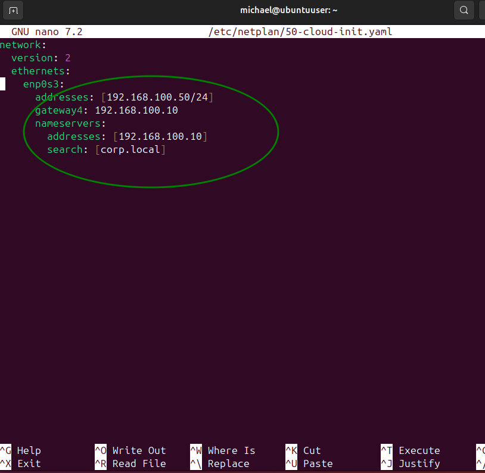
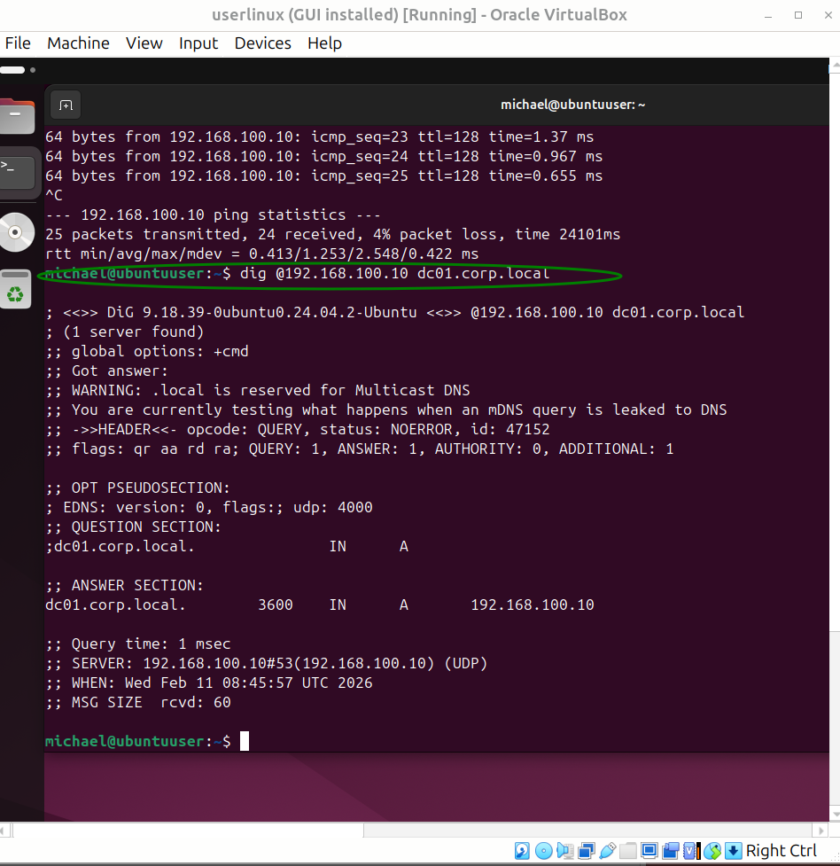

# 🧪 Lab Guide: Cross‑Platform DNS Troubleshooting (Windows DC + Ubuntu Client)

## 🎯 Lab 目標
在 Windows Server DC01 上配置 DNS Server。
在 Ubuntu client 上設定 static IP，並測試 cross‑platform DNS resolution。

---

## ⚙️ 環境準備
VirtualBox / VMware
Windows Server 2019/2022 (DC01)
Ubuntu 22.04/24.04 (client)
Internal Network: `intnet`

---

## 🖥 Windows Server 設定

### 1. 設定 IP
IP: `192.168.100.10`
Subnet Mask: `255.255.255.0`
Preferred DNS: `192.168.100.10`

### 2. 安裝 DNS Server Role
Server Manager → Add Roles → DNS Server

### 3. 建立 Zone
打開 **DNS Manager (`dnsmgmt.msc`)**
建立 Forward Lookup Zone: `corp.local`
建立 A record: `dc01 → 192.168.100.10`

### 4. 防火牆設定
打開 **wf.msc**
Enable inbound rules: **DNS (UDP-In)**、**DNS (TCP-In)**

---

## 🐧 Ubuntu Client 設定

### 1. 檢查 interface
bash
ip addr show enp0s3

### 2. 臨時測試
bash
sudo ip addr add 192.168.100.50/24 dev enp0s3
ping 192.168.100.10

### 3. 永久設定 (Netplan)
1.編輯 /etc/netplan/50-cloud-init.yaml：

yaml
network:
  version: 2
  ethernets:
    enp0s3:
      addresses: [192.168.100.50/24]
      routes:
        - to: default
          via: 192.168.100.10
      nameservers:
        addresses: [192.168.100.10]
        search: [corp.local]

2.套用：
bash
sudo netplan apply

3.測試
Ping 測試
bash
ping 192.168.100.10

4.DNS 測試
bash
dig @192.168.100.10 dc01.corp.local
nslookup dc01.corp.local
ping dc01.corp.local

5.成功回應
dc01.corp.local. 3600 IN A 192.168.100.10

### screenshots

