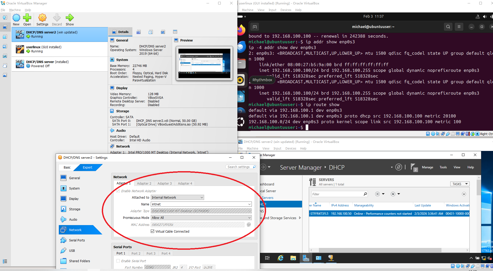
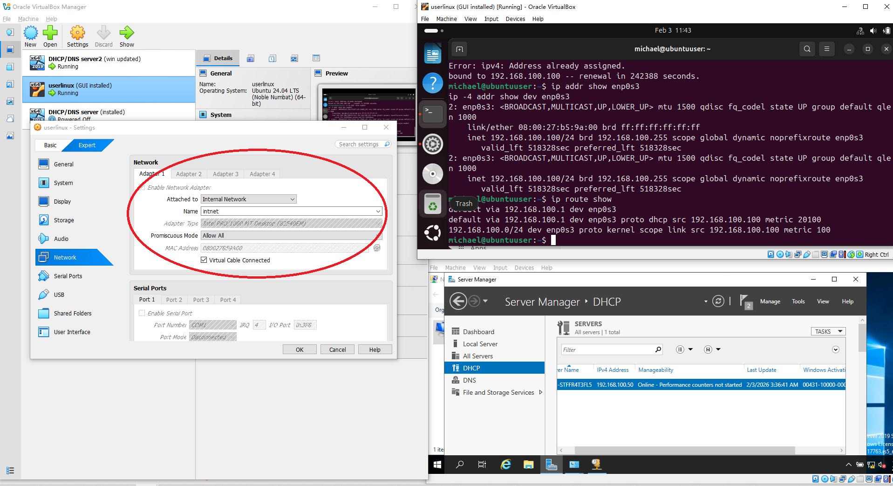
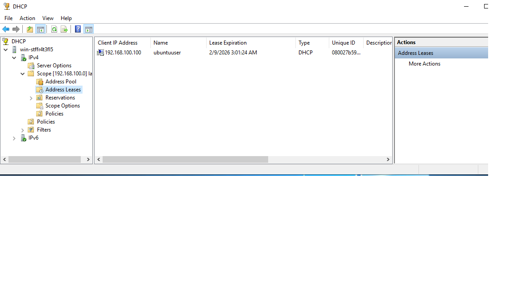
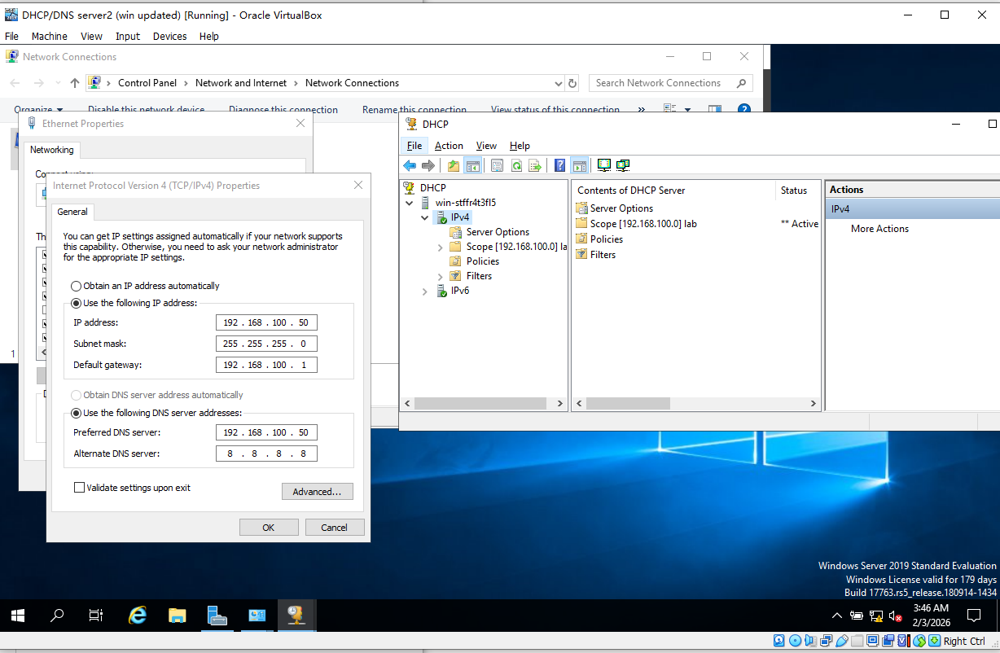

📝 Lab Report Section: Project Start – Connecting
## 1. VirtualBox 網絡設定
Windows Server VM
Adapter 1 → Internal Network → Name: intnet
Promiscuous Mode → Allow All
Ubuntu Client VM
Adapter 1 → Internal Network → Name: intnet
Promiscuous Mode → Allow All

## 2. Windows Server 配置
Static IP
IPv4 Address: 192.168.100.50
Subnet Mask: 255.255.255.0
Default Gateway: 192.168.100.1
DNS Server: 192.168.100.50（自己）
DHCP Scope
Range: 192.168.100.100 – 192.168.100.150
Subnet Mask: 255.255.255.0
Router (Gateway): 192.168.100.1
DNS Server: 192.168.100.50
Scope → Activate

## 3. Ubuntu Client 配置
Netplan 設定

yaml
network:
  version: 2
  ethernets:
    enp0s3:
      dhcp4: true
套用設定：

bash
sudo netplan apply
sudo dhclient -v enp0s3
驗證：

bash
ip addr show enp0s3
→ 攞到 192.168.100.100/24

## 4. 驗證連線
Ping Server
bash
ping 192.168.100.50
DNS Forward Lookup

bash
nslookup lab-srv01.lab.local
DNS Reverse Lookup

bash
nslookup 192.168.100.50

## 5. 結果
Client 成功攞到 DHCP 租約：192.168.100.100
Server 同 Client 可以互 ping
DNS Forward/Reverse Lookup 正常。
內聯網絡環境建立完成，Lab 可以進入下一階段。

## 6. 📸 Screenshots
✅ VirtualBox 網絡設定

✅ Ubuntu Client 驗證:

✅ DHCP Leases 記錄

✅ Windows Server IP 設定 + DHCP Scope

