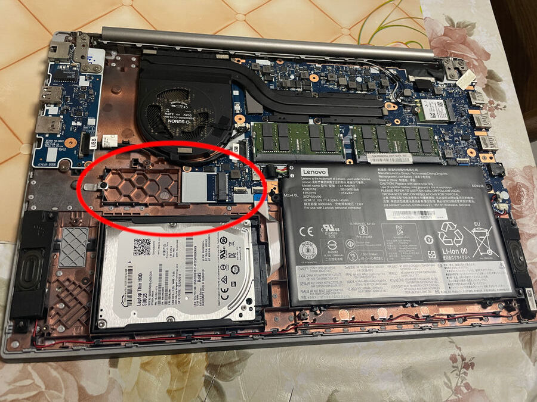
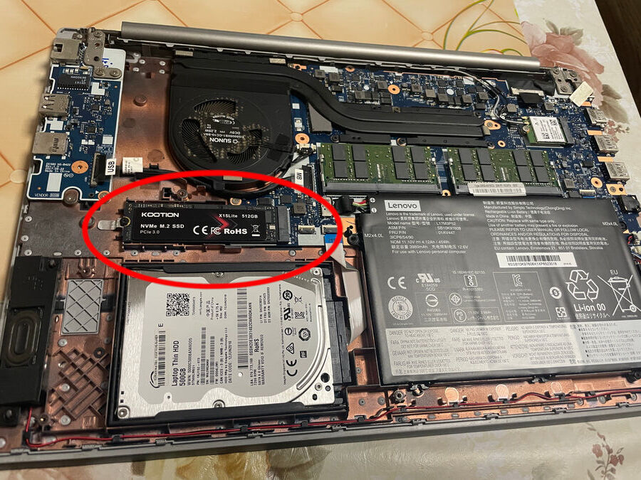
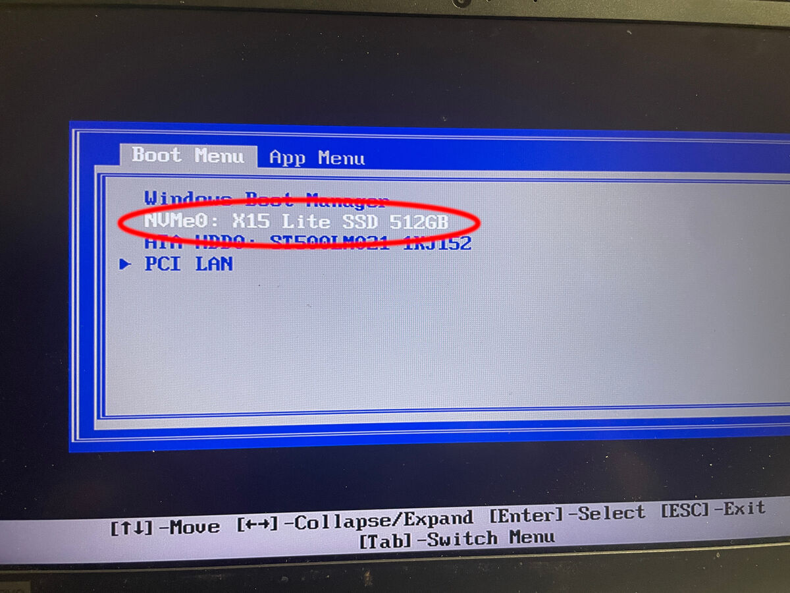

# 🖥️ M.2 SSD + Ubuntu Upgrade Lab Guide

## 1. Introduction
Objective: Demonstrate upgrading a notebook with a new M.2 SSD and installing Ubuntu 24.04.

Use Cases: Hardware upgrade, system rebuild, disaster recovery.

Expected Outcome: Clean OS installation, improved performance, enhanced maintainability.  

---

## 2. Preparation
[ ] Prepare M.2 SSD (NVMe/SATA, e.g., 512GB).

[ ] Tools: screwdriver, USB installation media.

[ ] Backup old drive data (VM lab, repo folders, documents).

[ ] Download Ubuntu ISO from official site, create bootable USB with Rufus.

---

## 3. Hardware Installation
[ ] Power off notebook, disconnect power, remove battery if possible.  
[ ] Open bottom cover, locate M.2 slot.  
[ ] Insert SSD, secure with screw.  
[ ] Boot into BIOS → verify SSD model and capacity.  

---

## 4. BIOS Configuration
[ ] Enable UEFI mode.
[ ] Disable Secure Boot if driver issues occur (Ubuntu sometimes easier without).
[ ] Ensure SSD detected.

---

## 5. Ubuntu Installation
[ ] Boot from USB (F12 Boot Menu).
[ ] Select new SSD as installation target.
[ ] Installer will format and partition automatically (ext4).
[ ] Complete installation → boot into Ubuntu desktop.  

---

## 6. Post‑Installation Verification
[ ] Run lsblk / df -h → confirm SSD capacity and partitions.
[ ] Install smartmontools → check health status:
'bash'
sudo smartctl -a /dev/nvme0n1
[ ] (Optional) Run fio or hdparm → record read/write performance. 

---

## 7. Environment Rebuild
[ ] Install Node.js + npm.  
[ ] Install Git.  
[ ] Install VM software (VMware / VirtualBox / Hyper‑V).  
[ ] Restore repo folders and VM lab files.  
[ ] Configure environment variables (tokens, gateway keys).  

---

## 8. Troubleshooting
[ ] SSD not detected → check slot and screw.
[ ] Ubuntu installation fails → verify ISO integrity, BIOS settings.
[ ] Driver issues → check dmesg, install proprietary drivers if needed. 

---

## 9. Consultant‑Style Benefits Analysis
Performance: Faster boot and application load times.
Maintainability: Clean OS, easier package management, long‑term stability.
Flexibility: Open-source ecosystem, reproducible lab environments. 

---

## 10. Conclusion
Successfully installed M.2 SSD and Ubuntu 24.04.
Verified SSD health and performance.
Rebuilt environment with repos and VM labs.
Upgrade delivers measurable improvements in speed, flexibility, and maintainability..  

---

### Hardware Installation (Step 3) 
Before inserting SSD:  After inserting SSD:  BIOS detects SSD: x